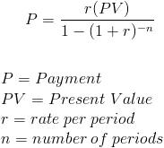

# Omnicalc 1

Dynamic web applications are more interesting than static websites for one reason: **user input.** Let's finally learn how to let our users give us input!

### [Here is the target we will ultimately build.](https://omnicalc-1.matchthetarget.com/)

## Setup

1. Start the web server by running `bin/server`.
1. Navigate to your live application preview.
1. As you work, remember to navigate to `/git` and **commit often as you work.**
1. Run `rails grade` as often as you like to see how you are doing, but **make sure you test your app manually first to make sure it matches the target's behavior first**.

## Forms

**Our users don't want to type input into the address bar; they want to type into forms!**

The way it should work is:

 - If I visit the ROUTE `/square/new`, I should see a form with a label and an input to enter a number.
    - If I submit that form, I should see the square of the number that I entered.
 - If I visit the ROUTE `/square_root/new`, I should see a form with a label and an input to enter a number.
    - If I submit that form, I should see the square root of the number that I entered.
 - If I visit the ROUTE `/payment/new`, I should see a form with labels and inputs to enter three values:
    - The APR (annual percentage rate).
    - The number of _years_ remaining.
    - The present value.
    - If I submit that form, I should see the **monthly** payment due given the values that I entered.
    - Mind your units! Use the formula located in the file `payment_formula.gif` in the same folder as this README.

        
 - If I visit the ROUTE `/random/new`, I should see a form with labels and inputs to enter two numbers, a minimum and a maximum.
    - If I submit that form, I should see a random number that falls between the numbers that I entered.

Play around and try various inputs in [the target](http://omnicalc-1.matchthetarget.com/) to see examples of how each form should behave.

### Valid, accessible forms

**In order for your tests to pass**, you must build _valid_ forms (your Chrome browser _may_ tolerate invalid forms while you are manually testing, but automated test suites reject invalid forms):

 - Each `<input>` in the form must have a unique `id=""` attribute.
 - The `<label>` associated with the `<input>` should have a `for=""` attribute that matches the value of the `<input>`'s `id`.
 - The copy within the `<label>` must exactly match the target — spelling, capitalization, and punctuation matter for labels.
 - The same goes for the copy on the button to submit the form.
 - Any invalid HTML within a form will cause the test to fail, e.g. an orphaned closing `</div>` tag. Keep your code neatly indented to help avoid this.

An example of a valid form; in particular, notice the `id=""` and `for=""` attributes:

```html
<form action="/random/results">
  <div>
    <label for="min_input">
      Minimum
    </label>

    <input id="min_input" type="text" name="user_min" placeholder="E.g. 1.5">
  </div>

  <div>
    <label for="max_input">
      Maximum
    </label>

    <input id="max_input" type="text" name="user_max" placeholder="E.g. 4.5">
  </div>

  <button>
    Pick random number
  </button>
</form>
```

#### Additional Hints

Rails pre-defines some helper methods that we can use inside View templates (the `.html.erb` files) that help us easily format the data we want to display.

In particular these two:

- [`number_to_currency()`](https://apidock.com/rails/ActionView/Helpers/NumberHelper/number_to_currency)
- [`number_to_percentage()`](https://apidock.com/rails/ActionView/Helpers/NumberHelper/number_to_percentage)

could be useful when formating the output of the payment form.

Click on them to read the documentation for the methods to learn more.

## Specs
<details>
  <summary>Click here to see names of each test</summary>

/square/new has one form element 

/square/new has a label with the text 'Enter a number' 

/square/new has one input element 

/square/new has a button element with text 'Calculate square' 

/square/new has form element with an action attribute 

/square/new leads to another functional RCAV when submitted 

/square/new captures the user's input in the query string 

/square/new works with an input of 5 

/square/new works with an input of 42.42 

/square_root/new has a form element 

/square_root/new has a label element with text 'Enter a number' 

/square_root/new has one input element 

/square_root/new has a button element with text 'Calculate square root' 

/square_root/new has a form with an action attribute 

/square_root/new leads to another functional RCAV when submitted 

/square_root/new captures the user's input in the query string 

/square_root/new works with an input of 5 

/square_root/new works with an input of 42.42 

/payment/new has a form element 

/payment/new has a label for APR 

/payment/new has a label for number of years 

/payment/new has a label for principal 

/payment/new has three inputs 

/payment/new has a button 

/payment/new has a form with an action attribute 

/payment/new leads to another functional RCAV when submitted 

/payment/new captures the user's input in the query string 

/payment/new correctly processes inputs when the form is submitted 

/payment/new rounds the payment to two decimal placements when the form is submitted 

/payment/new formats large dollar amounts on the results page 

/payment/new rounds the interest rate to four digits on the results page 

/payment/new formats the rate as a percentage on the results page 

/random/new has a form element 

/random/new has a label with text 'Minimum' 

/random/new has a label with text 'Maximum' 

/random/new has two input elements 

/random/new has a button element with text 'Pick random number' 

/random/new has a form with an action attribute 

/random/new leads to another functional RCAV when submitted 

/random/new captures the user's input in the query string 

/random/new outputs a random number when the form is filled out and submitted 

</details>
